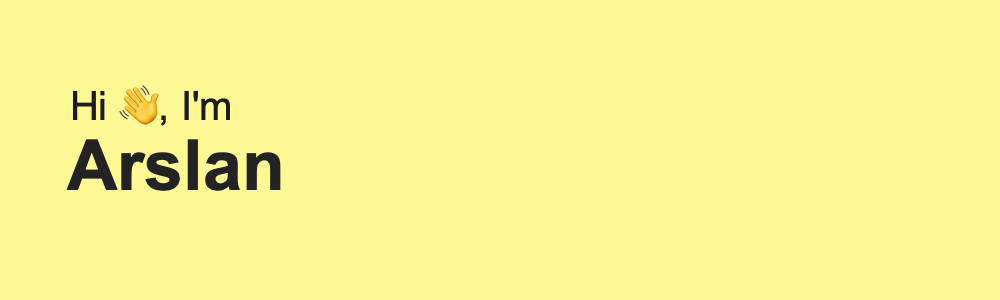

- 🔭 I’m currently working on DELI app and another projects.
- 🌱 I’m currently learning Objective C, iOS SDK.
- 📫 How to reach me: ars352@yahoo.com
- 😍 SwiftUI 

###### My packages:

CardValidationTF - (https://github.com/auranebes/CardValidationTF)

<!--
**auranebes/auranebes** is a ✨ _special_ ✨ repository because its `README.md` (this file) appears on your GitHub profile.

Here are some ideas to get you started:

- 🔭 I’m currently working on ...
- 🌱 I’m currently learning ...
- 👯 I’m looking to collaborate on ...
- 🤔 I’m looking for help with ...
- 💬 Ask me about ...
- 📫 How to reach me: ...
- 😄 Pronouns: ...
- ⚡ Fun fact: ...
-->
